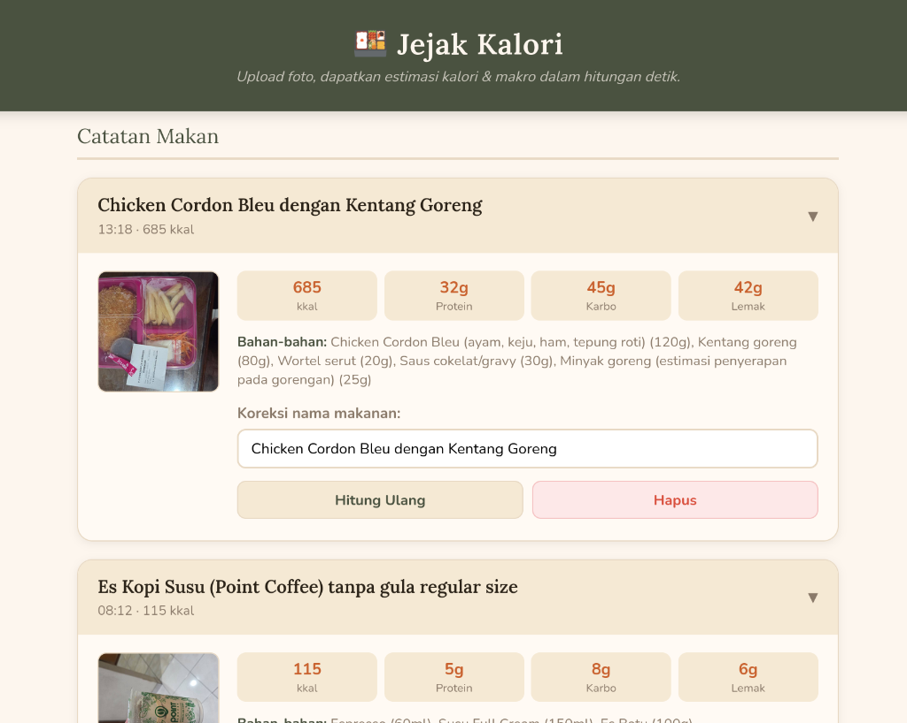
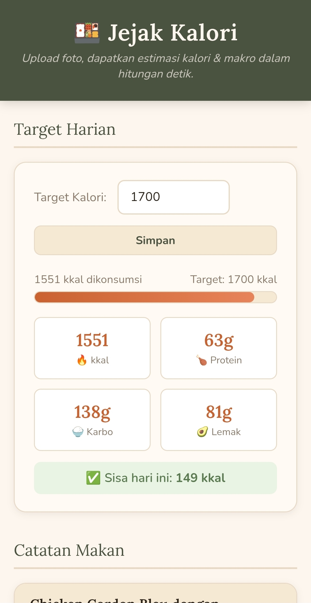

# Jejak Kalori 🍱

AI-powered food calorie and macronutrient tracker using **Google Gemini** or **Kilo.ai** (switchable). Upload a photo of your meal and get instant estimates for calories, protein, carbs, fat, and ingredient breakdowns — all in **Bahasa Indonesia**.

## Screenshots

| Desktop | Mobile |
|:-------:|:------:|
|  |  |

## Features

- 📸 **Image-based analysis** — Upload a food photo, get calorie & macro estimates via AI
- ✏️ **Text-based recalculation** — Correct food names and re-estimate nutrition from text
- 🔄 **Dual AI providers** — Switch between Google Gemini and Kilo.ai anytime, with automatic fallback
- 📊 **Daily goal tracking** — Set a calorie target and track your daily intake with visual progress bars
- 🕐 **Meal history** — Browse all past meals with expandable cards showing macros, ingredients, and photos
- 📱 **Mobile-first UI** — Responsive design with drag-and-drop upload, image preview, and toast notifications
- 🗄️ **SQLite storage** — Lightweight, zero-configuration database with embedded image blobs

## Architecture

```
Browser
  │
  │  AJAX POST
  ▼
Docker container (host network)
┌──────────────────────────────────────────────────────────┐
│  actions.php  ──►  FastAPI (main.py :8282)               │
│       │                    │                             │
│       ▼                    ▼                             │
│   SQLite DB          Gemini API  or  Kilo.ai API         │
│   (data/)              (default)    (backup/switchable)  │
└──────────────────────────────────────────────────────────┘
```

- **Frontend** — PHP built-in server on port **8501**
- **Backend** — FastAPI + Uvicorn on port **8282**
- Both run inside a single Alpine-based container with `network_mode: host`

1. User uploads a food photo in the PHP frontend (`index.php`).
2. `actions.php` compresses the image (max 1024px, JPEG quality 70) and POSTs it to FastAPI `/analyze`.
3. `main.py` forwards the image to the configured AI provider (Gemini or Kilo.ai) with a structured prompt requesting JSON output.
4. AI returns nutritional data (calories, protein, carbs, fat, ingredients).
5. `actions.php` stores the result in SQLite and returns the meal ID to the frontend.

## Prerequisites

- **Python 3.10+**
- **PHP 8.0+** with `sqlite3` and `gd` extensions enabled
- **Google Gemini API key**

## Setup

### 1. Python environment

```bash
python -m venv .venv
source .venv/bin/activate   # Linux/macOS
# .venv\Scripts\activate    # Windows
pip install -r requirements.txt
```

### 2. Configure API keys

Create a `.env` file in the project root:

```
# Required: Gemini API key
GEMINI_API_KEY=your_gemini_api_key_here

# Optional: Kilo.ai API key (for backup/fallback)
KILO_API_KEY=your_kilo_api_key_here

# AI Provider selection (default: "gemini")
# Options: "gemini", "kilo", "auto" (auto = fallback to kilo if gemini fails)
AI_PROVIDER=gemini
```

**Getting a Kilo.ai API key:**
1. Sign up at [kilo.ai](https://kilo.ai)
2. Go to Settings → API Keys
3. Create a new key and copy it to your `.env` file

### 3. Verify PHP extensions

Ensure your PHP installation has the following extensions enabled:

- `sqlite3`
- `gd`
- `curl`

You can check with: `php -m | grep -E 'sqlite3|gd|curl'`

## Running the App

### Option A: Docker Compose (recommended)

```bash
# Make sure GEMINI_API_KEY (and optionally KILO_API_KEY) is set in .env
echo "GEMINI_API_KEY=your_key_here" >> .env
echo "KILO_API_KEY=your_kilo_key_here" >> .env  # optional
echo "AI_PROVIDER=auto" >> .env  # optional, enables fallback

docker compose up -d
```

- **Frontend** → `http://<your-ip>:8501`
- **Backend API** → `http://<your-ip>:8282`
- SQLite data persists via the `data/` volume mount.

```bash
# View logs
docker compose logs -f

# Stop
docker compose down
```

### Option B: Manual (development)

### Start the FastAPI backend

```bash
python main.py
# Serves on http://127.0.0.1:8282
```

### Start the PHP frontend (separate terminal)

```bash
php -S localhost:8501
# Open http://localhost:8501 in your browser
```

## API Endpoints (FastAPI)

| Method | Path | Description |
|--------|------|-------------|
| `POST` | `/analyze` | Accepts multipart `image` file. Returns JSON: `nama_makanan`, `bahan_makanan[]`, `total_kalori`, `protein_g`, `karbohidrat_g`, `lemak_g`. |
| `POST` | `/recalculate` | Accepts JSON `{ "food_name": "..." }`. Returns same schema as `/analyze`. |

## PHP Actions (AJAX)

All requests are `POST` to `actions.php` with an `action` field.

| Action | Parameters | Description |
|--------|-----------|-------------|
| `analyze` | `image` (file) | Compress image, call Gemini API, store meal in DB. Returns `meal_id`. |
| `recalculate` | `meal_id`, `food_name` | Call Gemini API with food name, update DB row. |
| `delete` | `meal_id` | Remove a single meal entry. |
| `set_goal` | `goal` (500–10000) | Update daily calorie goal. |
| `clear` | — | Delete all meal records. |

## Database Schema

**`meals`** table:

| Column | Type | Description |
|--------|------|-------------|
| `id` | INTEGER | Auto-incrementing primary key |
| `timestamp` | DATETIME | Record creation time (default: `CURRENT_TIMESTAMP`) |
| `file_name` | TEXT | Original uploaded file name |
| `food_name` | TEXT | AI-identified food name |
| `calories` | INTEGER | Total estimated calories (kkal) |
| `protein` | INTEGER | Protein (grams) |
| `carbs` | INTEGER | Carbohydrates (grams) |
| `fat` | INTEGER | Fat (grams) |
| `ingredients` | TEXT | JSON array of ingredient strings with weight estimates |
| `image_blob` | BLOB | Compressed JPEG image data |

**`settings`** table:

| Column | Type | Description |
|--------|------|-------------|
| `key` | TEXT | Setting identifier (primary key) |
| `value` | TEXT | Setting value |
| Default row: `('daily_calorie_goal', '2000')` |

## Configuration

| Env Var / Constant | Default | Description |
|---|---|---|
| `AI_PROVIDER` | `gemini` | AI provider to use: `"gemini"`, `"kilo"`, or `"auto"` (auto-fallback) |
| `GEMINI_API_KEY` | *(required)* | Google Gemini API key (set in `.env`) |
| `GEMINI_MODEL` | `gemini-3-flash-preview` | Gemini model used for analysis |
| `GEMINI_TEMPERATURE` | `0.1` | Low temperature for consistent, deterministic output |
| `GEMINI_MIME_TYPE` | `application/json` | Response format requested from Gemini |
| `KILO_API_KEY` | *(optional)* | Kilo.ai API key (for backup/fallback provider) |
| `KILO_MODEL` | `anthropic/claude-sonnet-4.5` | Kilo.ai model to use (via Gateway) |
| `KILO_MAX_TOKENS` | `2000` | Max tokens for Kilo.ai responses |
| `API_HOST` | `127.0.0.1` | FastAPI bind address |
| `API_PORT` | `8282` | FastAPI port |
| `MAX_IMG_SIDE` | `1024` | Maximum image dimension in pixels (PHP compression) |
| `IMG_QUALITY` | `70` | JPEG compression quality (0–100) |

### AI Provider Modes

- **`AI_PROVIDER=gemini`** (default) — Use only Google Gemini
- **`AI_PROVIDER=kilo`** — Use only Kilo.ai (Gemini not used)
- **`AI_PROVIDER=auto`** — Use Gemini first, automatically fallback to Kilo.ai if Gemini fails (503, timeout, etc.)

This allows you to **switch providers anytime** by changing the `AI_PROVIDER` env var and restarting the backend.

## Project Structure

```
.
├── main.py            # FastAPI backend — /analyze, /recalculate (dual provider support)
├── config.py          # App config: Gemini/Kilo clients, model, host/port, logging
├── prompts.py         # AI prompt templates (Indonesian) for image & text analysis
├── kilo_client.py     # Kilo.ai API client (OpenAI-compatible gateway)
├── requirements.txt   # Python dependencies
├── index.php          # PHP frontend — single-page UI with upload, goals, meal cards
├── actions.php        # PHP AJAX handler — image compression, API calls, DB operations
├── Dockerfile         # Alpine-based image with PHP 8.3 + Python 3
├── docker-compose.yml # Single-container compose setup (host network)
├── entrypoint.sh      # Starts both PHP and FastAPI servers
├── .dockerignore      # Excludes .venv, __pycache__, .git from image
├── data/
│   └── food_tracker.db   # SQLite database (git-ignored, bind-mounted)
├── backups/           # Database backups (git-ignored)
└── .env               # API keys (git-ignored)
```

## Response Format

Gemini returns structured JSON in **Indonesian**:

```json
{
  "nama_makanan": "Nasi Goreng Spesial",
  "bahan_makanan": [
    "nasi putih (est. 150g)",
    "ayam suwir (est. 80g)",
    "telur ceplok (est. 50g)",
    "minyak goreng (est. 14g)",
    "kecap manis (est. 10g)"
  ],
  "total_kalori": 520,
  "protein_g": 22,
  "karbohidrat_g": 65,
  "lemak_g": 18
}
```

## Key Design Decisions

- **Image compression**: PHP compresses images before sending to Python to reduce API payload size and cost.
- **Retry logic**: Both the Python and PHP layers retry Gemini API calls up to 3 times with a 1-second delay for 503/unavailable errors.
- **Embedded images**: Meal photos are stored as BLOBs in SQLite for a self-contained, zero-infrastructure setup.
- **Indonesian language**: All prompts, UI text, and response field names are in Bahasa Indonesia, targeting Indonesian users and using Indonesian nutritional references (e.g., FatSecret Indonesia).
